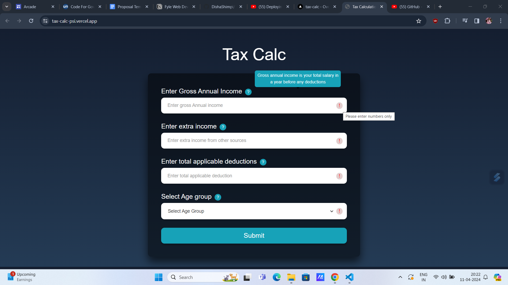
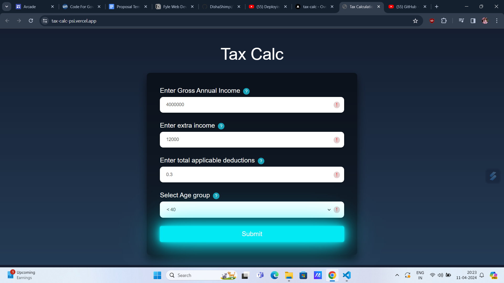
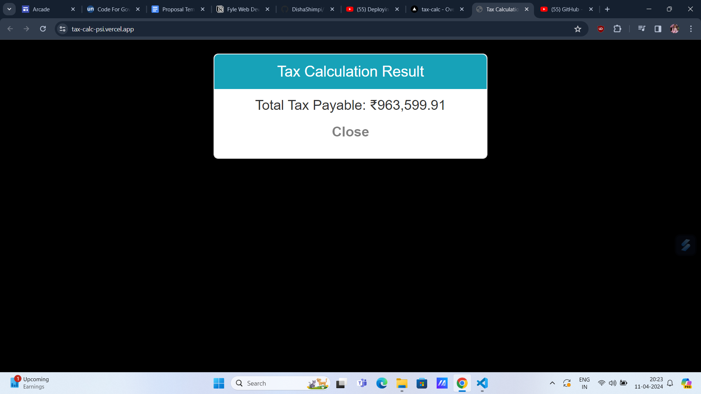

# Tax-Calc
This project is a tax calculation form using HTML, CSS, Bootstrap, JS, and jQuery. It calculates taxes based on income and age, with error handling and mandatory field validation. Results are displayed in a modal. Responsive design ensures usability.

->Info and error handling hover

->Form with animated button

->Calculation page

<h3>Live Demo: <a href="https://tax-calc-psi.vercel.app/">Tax-Calculator</a> </h3>
